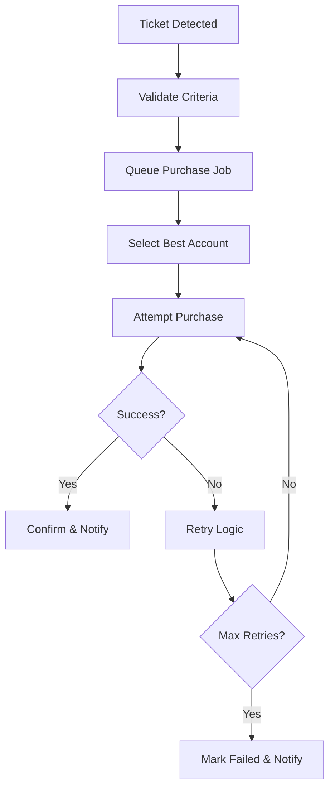

# System Architecture Documentation
## HDTickets - Comprehensive Sport Events Entry Tickets Monitoring, Scraping and Purchase System
**Version:** 4.0.0
**By:** Lubomir Polascin (Ľubomír Polaščín) aka Walter Csoelle

### Overview
This document outlines the comprehensive system architecture for HDTickets, a high-performance Sports Events Entry Tickets Monitoring, Scraping and Purchase System designed to monitor, scrape, and automate ticket purchases across multiple platforms with real-time monitoring, AI-powered alerts, automated purchasing, and advanced analytics capabilities.

## Multi-tier Architecture

### 1. Presentation Layer
**Technology Stack:** Vue.js with Inertia.js

- **Dashboard Interface**
  - Real-time ticket availability monitoring
  - Account management interface (1000+ accounts)
  - Purchase history and analytics
  - Configuration panels for scrapers and automation rules
  - Notification settings and preferences
  
- **Key Features**
  - Server-side rendering with Inertia.js for optimal performance
  - Reactive components using Vue 3 Composition API
  - Real-time updates via WebSockets/Server-Sent Events
  - Responsive design for desktop and mobile access
  - Role-based access control interface

### 2. Application Layer
**Technology Stack:** Laravel with RESTful API Architecture

#### Core API Endpoints
```
/api/v1/accounts          # Account management
/api/v1/platforms         # Platform configurations
/api/v1/scrapers          # Scraper management
/api/v1/tickets           # Ticket monitoring
/api/v1/purchases         # Purchase automation
/api/v1/notifications     # Notification system
/api/v1/analytics         # Reporting and analytics
```

#### Middleware Stack
- Authentication & Authorization (Sanctum/Passport)
- Rate Limiting & Throttling
- CORS Management
- Request/Response Logging
- Error Handling & Reporting

### 3. Data Layer
**Primary Database:** MySQL 8.0+
**Caching Layer:** Redis 6.0+

#### Database Architecture
- **Master-Slave Configuration** for read/write separation
- **Connection Pooling** for optimal performance
- **Automated Backups** with point-in-time recovery
- **Database Sharding** for account data (future scaling)

#### Redis Implementation
- **Session Storage** for user sessions
- **Job Queue Management** for background tasks
- **Cache Layer** for frequently accessed data
- **Real-time Data** for WebSocket communications

## Key Components

### 1. Account Manager
**Purpose:** Centralized management of 1000+ ticket platform accounts

#### Features
- **Multi-Platform Support**
  - Ticketmaster, StubHub, SeatGeek, Vivid Seats, etc.
  - Custom platform integration framework
  - Platform-specific authentication handling

- **Account Lifecycle Management**
  - Automated account health checks
  - Credential rotation and security updates
  - Account performance tracking and analytics
  - Bulk import/export capabilities

- **Security Measures**
  - Encrypted credential storage (AES-256)
  - OAuth token management
  - Two-factor authentication support
  - Account isolation and sandboxing

#### Database Schema
```sql
accounts (id, platform_id, username, encrypted_credentials, status, last_check)
platforms (id, name, base_url, api_endpoints, scraper_config)
account_sessions (id, account_id, session_token, expires_at)
```

### 2. Scraping Engine
**Purpose:** Modular, scalable ticket data extraction system

#### Architecture
- **Plugin-Based System** for easy platform additions
- **Distributed Processing** using Laravel Horizon
- **Anti-Detection Mechanisms** with rotating proxies
- **Data Validation** and consistency checks

#### Core Components
```php
abstract class BaseScraper {
    protected $platform;
    protected $proxyRotator;
    protected $captchaHandler;
    
    abstract public function scrapeTickets();
    abstract public function validateData();
}

class TicketmasterScraper extends BaseScraper { ... }
class StubHubScraper extends BaseScraper { ... }
```

#### Features
- **Real-time Scraping** with configurable intervals
- **Batch Processing** for historical data
- **Error Recovery** and retry mechanisms
- **Data Normalization** across platforms
- **Performance Monitoring** and optimization

### 3. Monitoring Service
**Purpose:** Continuous ticket availability tracking and alerting

#### Background Job Architecture
```php
// Queue Configuration
'connections' => [
    'redis' => [
        'driver' => 'redis',
        'connection' => 'default',
        'queue' => env('REDIS_QUEUE', 'default'),
        'retry_after' => 90,
        'block_for' => null,
    ],
]

// Job Types
CheckTicketAvailability::class
MonitorPriceChanges::class
ValidateAccountHealth::class
ProcessPurchaseRequests::class
```

#### Monitoring Features
- **Multi-threaded Processing** for concurrent checks
- **Intelligent Scheduling** based on event importance
- **Anomaly Detection** for unusual patterns
- **Health Dashboards** with real-time metrics
- **Alert Escalation** systems

### 4. Purchase Automation
**Purpose:** Automated ticket purchasing with queue management

#### Queue System Architecture
- **Priority-based Processing** (VIP events first)
- **Distributed Workers** across multiple servers
- **Failure Handling** with automatic retries
- **Transaction Logging** for audit trails

#### Purchase Flow


#### Features
- **Smart Account Selection** based on success rates
- **Purchase Speed Optimization** (sub-second execution)
- **Payment Method Management** with tokenization
- **Duplicate Prevention** mechanisms
- **Success Rate Tracking** and optimization

### 5. Notification System
**Purpose:** Multi-channel communication system

#### Supported Channels
- **Email Notifications** (SMTP/SendGrid/SES)
- **SMS Alerts** (Twilio/Nexmo integration)
- **Push Notifications** (FCM/APNS)
- **Webhook Integrations** for third-party systems
- **In-app Notifications** with real-time delivery

#### Notification Types
```php
class NotificationTypes {
    const TICKET_AVAILABLE = 'ticket_available';
    const PURCHASE_SUCCESS = 'purchase_success';
    const PURCHASE_FAILED = 'purchase_failed';
    const ACCOUNT_ISSUE = 'account_issue';
    const SYSTEM_ALERT = 'system_alert';
    const PRICE_ALERT = 'price_alert';
}
```

## Security Considerations

### 1. Encrypted Credential Storage
- **AES-256-GCM Encryption** for sensitive data
- **Key Management** using Laravel's encryption system
- **Credential Rotation** on security events
- **Access Logging** for audit compliance

```php
// Encryption Implementation
use Illuminate\Contracts\Encryption\Encrypter;

class SecureCredentialManager {
    public function storeCredentials($accountId, $credentials) {
        $encrypted = encrypt(json_encode($credentials));
        // Store with audit trail
    }
}
```

### 2. Rate Limiting and Proxy Rotation
- **Intelligent Rate Limiting** per platform
- **Proxy Pool Management** with health monitoring
- **IP Rotation Strategies** to avoid detection
- **Request Pattern Randomization**

```php
// Rate Limiting Configuration
'throttle' => [
    'api' => \Illuminate\Routing\Middleware\ThrottleRequests::class.':60,1',
    'scraping' => \App\Http\Middleware\ScrapingThrottle::class,
],
```

### 3. CAPTCHA Handling Strategies
- **2captcha Integration** for automated solving
- **reCAPTCHA v2/v3** detection and handling
- **hCaptcha Support** for alternative platforms
- **Fallback Mechanisms** for unsupported types
- **Success Rate Optimization** through ML learning

#### CAPTCHA Service Integration
```php
class CaptchaResolver {
    protected $services = [
        '2captcha' => TwoCaptchaService::class,
        'anticaptcha' => AntiCaptchaService::class,
        'deathbycaptcha' => DeathByCaptchaService::class,
    ];
    
    public function solve($captchaType, $imageData) {
        // Smart service selection based on type and success rates
    }
}
```

## Infrastructure Requirements

### Server Specifications
- **Web Servers:** 4+ CPU cores, 16GB RAM, SSD storage
- **Database Server:** 8+ CPU cores, 32GB RAM, NVMe SSD
- **Redis Cache:** 8GB+ dedicated memory
- **Proxy Servers:** Distributed global network

### Scalability Considerations
- **Horizontal Scaling** with load balancers
- **Database Sharding** for large datasets
- **CDN Integration** for static assets
- **Microservice Migration** path for future growth

### Monitoring and Logging
- **Application Performance Monitoring** (New Relic/Datadog)
- **Error Tracking** (Sentry/Bugsnag)
- **System Metrics** (Prometheus/Grafana)
- **Log Aggregation** (ELK Stack)

## Development Environment Setup
Based on your Laragon configuration at `C:\laragon` with document root `G:\Môj disk\www`:

```bash
# Project Structure
G:\Môj disk\www\ticket-automation\
├── app/
│   ├── Models/
│   ├── Services/
│   ├── Jobs/
│   └── Http/Controllers/Api/
├── resources/js/ (Vue.js components)
├── database/migrations/
├── config/
└── tests/
```

## Security Compliance
- **GDPR Compliance** for EU user data
- **PCI DSS** considerations for payment processing
- **SOC 2 Type II** audit readiness
- **Data Encryption** at rest and in transit
- **Regular Security Audits** and penetration testing

This architecture provides a robust, scalable foundation for automated ticket purchasing while maintaining security, performance, and reliability at enterprise scale.
